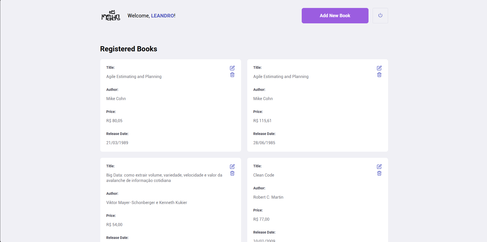
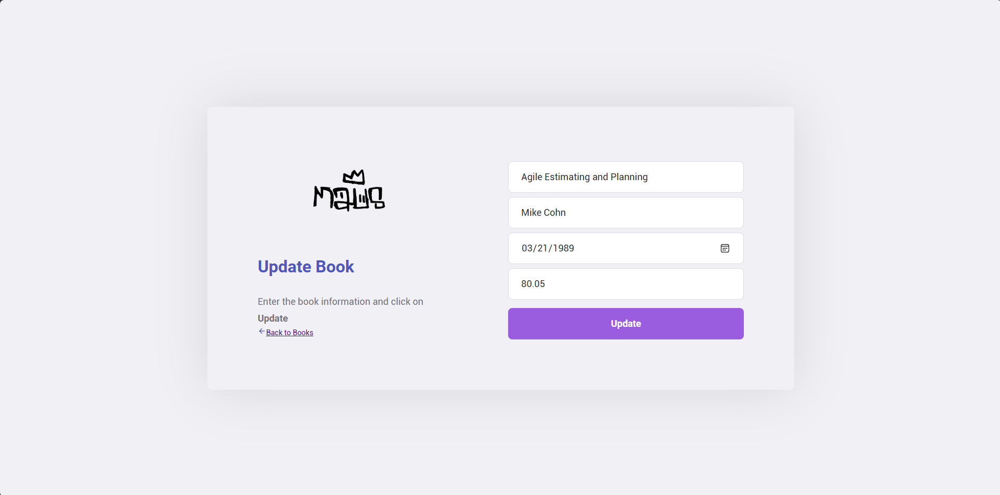
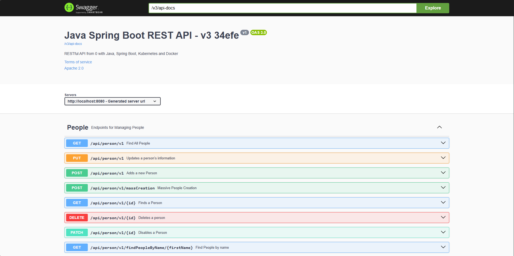
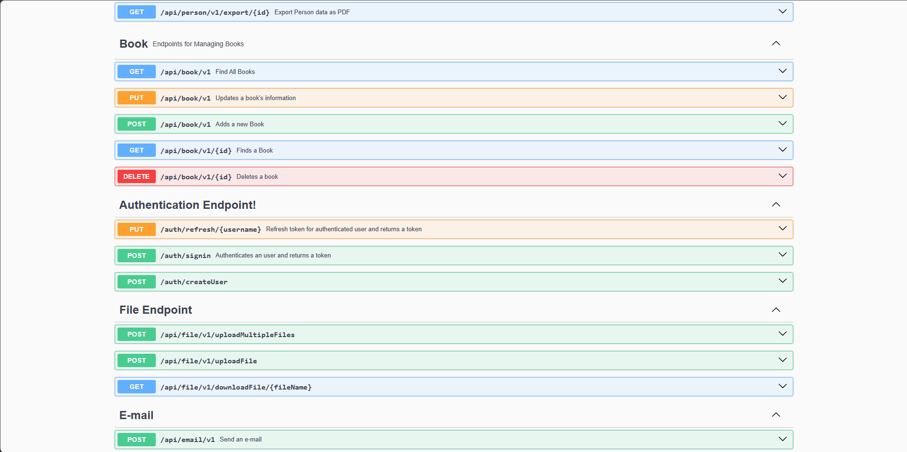

[](https://github.com/the-maus/springboot-java-rest/actions/workflows/continuous-deployment.yml)

[](https://hub.docker.com/repository/docker/themaus/springboot-java-rest/general)

# 🚀 Rest with Spring Boot 3.4.1 and Java 21

**Full stack project** with **React frontend** and **Spring Boot backend**, focused on applying **best practices, design patterns, and modern REST architecture**, built as a hands-on laboratory and **professional portfolio project**.

---

## 🧠 About the Project

This project aims to apply, in practice, the main features of **Spring Boot** to build a **robust, scalable, and well-architected REST API**, using modern concepts such as:

- RESTful architecture
- HATEOAS with HAL
- Content Negotiation
- Design Patterns
- Automated Testing
- Containerization with Docker

Additionally, the project includes a **React frontend** that consumes the API, delivering a complete **full stack experience**.

---

## 🏗️ Architecture

- **Backend:** Spring Boot (Java)
- **Frontend:** React
- **Database:** MySQL
- **ORM:** Spring Data JPA + Hibernate
- **Database Migrations:** Flyway
- **Containerization:** Docker + Docker Compose
- **API Documentation:** Swagger (OpenAPI)

### REST Standards
- RESTful
- Content Negotiation
- HATEOAS with HAL

---

## 🧩 Features

- Full CRUD for **Customers**
- Full CRUD for **Books**
- File upload and download
- Data import from **Excel**
- Data export to **Excel** and **CSV**
- Professional **report generation** using JasperReports and Apache POI
- **Email sending** using Spring Mail + Gmail SMTP
- Interactive API documentation with **Swagger**

---

## 🏛️ Design Patterns Used

- DTO (Data Transfer Object)
- Builder
- Fluent Interface
- Factory
- Strategy

---

## 🧪 Automated Testing

### Unit Tests
- JUnit 5
- Mockito

### Integration Tests
- JUnit 5
- Mockito
- REST Assured
- Testcontainers

---

## 🛠️ Tech Stack

### Backend
- Java 17+
- Spring Boot
- Spring Data JPA
- Hibernate
- Flyway
- Swagger (OpenAPI)
- JasperReports
- Apache POI
- Spring Mail

### Frontend
- React
- Axios

### DevOps / Infrastructure
- Docker
- Docker Compose
- MySQL

---

## ⚙️ Running with Docker

### Requirements

- Docker
- Docker Compose

### Steps

```bash
git clone https://github.com/the-maus/springboot-java-rest.git
cd springboot-java-rest

docker compose up -d --build
```
## 📸 Screenshots

### 🔐 Login Page

### 📚 Dashboard — Books Listing
Main system dashboard with book listing, editing, and deletion features.

### ✏️ Book Creation and Editing


---

### 📑 API Documentation — Swagger (OpenAPI)
Complete view of available resources: authentication, books, customers, files, and emails.

